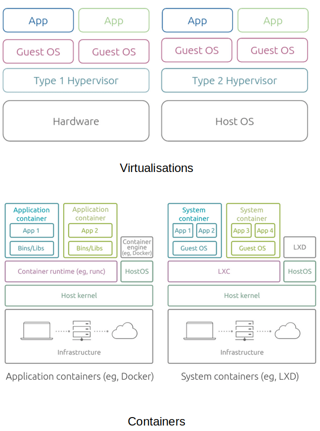

# System Engineering: Working Examples and References

A collection of working examples and references to learning materials about all things system engineering compiled by [CONTRIBUTORS](./CONTRIBUTORS).

## Working Examples

* Algorithms and data models
    * [Go algorithm and data models](https://github.com/paulwizviz/go-algorithm)
* Artifical Intelligence (Machine Learning, etc)
    * [Examples demonstrating applications interaction with LLM](https://github.com/paulwizviz/llm-api-examples.git)
* Application Programming Interfaces
    * [GraphQL implementation in Go](https://github.com/paulwizviz/graphql-template)
* Container technologies
    * [Kubernetes examples](https://github.com/paulwizviz/k8s-examples.git)
* Messaging patterns
    * [MQTT for Go programming](https://github.com/paulwizviz/go-mqtt)
    * [NATS for Go programming](https://github.com/paulwizviz/go-nats)
    * [Kafka for Go programming](https://github.com/paulwizviz/go-kafka)
* Cryptography and security
    * [Examples using Go for cryptographic programming](https://github.com/paulwizviz/go-crypto)
    * [Examples using Go implementing security](https://github.com/paulwizviz/go-security)
* Datastores
    * [Timeseries DB for Go programming](https://github.com/paulwizviz/go-timeseriesdb.git)
* Networking
    * [Network programming in Go](https://github.com/paulwizviz/go-networking.git)
* Serialization
    * [Examples of serialization in Go](https://github.com/paulwizviz/go-serialization.git)

## References

* [Algorithms and Performance Analysis](#algorithms-and-performance-analysis)
* [Container Technologies](#container-technologies)
* [Cryptography and Security](#cryptography-and-security)
* [Distributed and Decentralized Systems](#distributed-and-decentralized-systems)
* [Databases](#databases)
* [Data Serialization](#data-serialization)
* [Networking](#networking)

### Artifical Intelligence

* [AI vs ML vs DL vs DS - Difference Explained | AI For Beginners](https://www.youtube.com/watch?v=hhFG9X3h8t8)

### Algorithms and Performance Analysis

* [Algorithms and Data Structures Tutorial - Full Course for Beginners](https://www.youtube.com/watch?v=8hly31xKli0)
* [A beginner's guide to Big O Notation](https://robbell.io/2009/06/a-beginners-guide-to-big-o-notation)
* [Overview of BigO with my working examples](./docs/bigo.md)

### Container Technologies

* [What Is Container Technology?](https://www.solarwinds.com/resources/it-glossary/container)
* [Containers vs Virtualization by Miona Aleksic](https://ubuntu.com/blog/containerization-vs-virtualization)
* `chroot` (Change root) is a Unix system utility used to change the apparent root directory to create a new environment logically separate from the main system's root directory.  
    * [How to Use the chroot Command on Linux](https://www.howtogeek.com/441534/how-to-use-the-chroot-command-on-linux/)
    * [Working examples](./examples/chroot/jailer.sh)
* [Docker](./docs/docker.md)
* Kubernetes
    * [Kubernetes Components](https://kubernetes.io/docs/concepts/overview/components/)
    * [The Kubernetes API](https://kubernetes.io/docs/concepts/overview/kubernetes-api/)
    * [Working with Kubernetes Objects](https://kubernetes.io/docs/concepts/overview/working-with-objects/)
    * [Cluster Architecture](https://kubernetes.io/docs/concepts/architecture/)

### Cryptography and Security

All things related to cryptography and security

* Cryptography
    * [Cryptography Concepts - SY0-601 CompTIA Security+ : 2.8](https://www.youtube.com/watch?v=A6HNd1EGfIc)
    * [Asymetric](./docs/asymetic.md)
    * Modular Mathematics
        * [The Mathematics of Cryptography](https://www.youtube.com/watch?v=uNzaMrcuTM0)
        * [Modular Arithmetic Visually Explained](https://www.youtube.com/watch?v=lJ3CD9M3nEQ)
    * [Symmetric](./docs/symmetric.md)
    * Stream and block ciphers
        * [Streams and block ciphers](https://www.youtube.com/watch?v=7J2XbZNNF4A)
        * [Block Cipher Modes - CompTIA Security+ SY0-501 - 6.2](https://www.youtube.com/watch?v=6rE-KlhBlq4)

* Security - The application of cryptographic techniques.
    * [Checksum](https://www.techtarget.com/searchsecurity/definition/checksum)      
    * [Digital certificates](./docs/certs.md)
    * Public Key Infrastructure
        * [PKI Components - CompTIA Security+ SY0-501 - 6.4](https://www.youtube.com/watch?v=3yuad7_bszE)

### Distributed and Decentralized Systems

A distributed system is a type of system architectural pattern where processes is distributed across multiple platforms or nodes. There are two broad categories of distributed system: centralised and decentralised. 

A decentralized version refer to [my blockchain project](https://github.com/paulwizviz/my-blockchain). 

A centralised distributed system architecture include:

* Architectural patterns
    * [Microservices explained - the What, Why and How?](https://www.youtube.com/watch?v=rv4LlmLmVWk).
    * [7 Most-Used Distributed System Patterns](https://www.youtube.com/watch?v=nH4qjmP2KEE).
    * [The Many Meanings of Event-Driven Architecture by Martin Fowler](https://www.youtube.com/watch?v=STKCRSUsyP0)
    * [Creating event-driven microservices: the why, how and what by Andrew Schofield](https://www.youtube.com/watch?v=ksRCq0BJef8)
* Communication patterns
    * [GraphQL](https://graphql.org/)    
    * [gRPC](https://grpc.io/docs/what-is-grpc/introduction/) and also see [Protobuf](#data-serialization)     
    * [REST](./docs/rest.md)
    * [MQTT](./docs/mqtt.md)
    * [Kafka](./docs/kafka.md)

### Databases

There are three categorise of databases: NoSQL, Timeseries and SQL databases.

* [NoSQL](https://www.mongodb.com/resources/basics/databases/nosql-explained)
* [Time Series DB](https://www.influxdata.com/time-series-database/)
    * [InfluxDB](https://docs.influxdata.com/)
        * [FluxQL](https://docs.influxdata.com/influxdb/cloud/reference/syntax/flux/flux-vs-influxql/)
        * [InfuxDB: Overview, Key Concepts and Demo | Getting Started](https://www.youtube.com/watch?v=gb6AiqCJqP0)
* [SQL databases](https://github.com/paulwizviz/learn-sql) for further discussion on this topic.

### Data Serialization

This section discuss all things related to data encoding formats.

* Abstract Syntax Notation One (ASN.1) - A standard interface description language for defining data structures that can be serialized and deserialized in a cross-platform way. It is broadly used in telecommunications and computer networking, and especially in cryptography.
    * [Introduction to ASN.1](https://www.itu.int/en/ITU-T/asn1/Pages/introduction.aspx)
    * [A Warm Welcome to ASN.1 and DER](https://letsencrypt.org/docs/a-warm-welcome-to-asn1-and-der/)
    * [OSS Nokalva - ASN](https://www.oss.com/resources/resources.html)
    * [ASN.1 Quick Reference](https://www.oss.com/asn1/resources/asn1-made-simple/asn1-quick-reference.html)
    * [ASN1 Simple types](https://www.obj-sys.com/asn1tutorial/node10.html)
    * [A Layman's Guide to a Subset of ASN.1, BER, and DER](http://luca.ntop.org/Teaching/Appunti/asn1.html)
* [Base64](https://en.wikipedia.org/wiki/Base64) - A group of binary-to-text encoding schemes that represent binary data (more specifically, a sequence of 8-bit bytes) in sequences of 24 bits that can be represented by four 6-bit Base64 digits.
    * [RFC 4648](https://datatracker.ietf.org/doc/html/rfc4648)
* Distinguished Encoding Rules (DER) encoding - A binary encoding for X.509 certificates and private keys. DER-encoded files are usually found with the extensions `.der` and `.cer`.
* [Concise Binary Object Representation (CBOR)](https://cbor.io/) - A data format whose design goals include the possibility of extremely small code size, fairly small message size, and extensibility without the need for version negotiation.
    * [RFC 8949](https://datatracker.ietf.org/doc/html/rfc8949)
* [Gob](https://go.dev/blog/gob) - A Go-specific data package for communicating between two servers written in Go.
* [Ini File](https://en.wikipedia.org/wiki/INI_file)  - A text based configuration file comprising of key value pair.
* [Privacy Enhanced Mail (PEM) Encoding](./docs/pem.md)
* [Protobuf](https://protobuf.dev/)   
* [Tom's Obvious Minimal Language (TOML)](https://toml.io/en/) is a minimal configuration file format that's easy to read due to obvious semantics. TOML is designed to map unambiguously to a hash table.
* [YAML Ain’t Markup Language (YAML)](https://yaml.org/spec/1.2.2/) - A recursive acronym for “YAML Ain’t Markup Language” is a data serialization language based on a the use of indentation. It is intended to be human readable.

### Networking

* [Practical Networking](https://www.youtube.com/watch?v=bj-Yfakjllc&list=PLIFyRwBY_4bRLmKfP1KnZA6rZbRHtxmXi)
* Software Networking and Interfaces on Linux
    * [Part 1](https://www.youtube.com/watch?v=EnAZB8GI97c)
    * [Part 2](https://www.youtube.com/watch?v=5WNEpE1vLvc)
* [OSI model](./docs/osi.md)
* [Internet of Things](./docs/iot.md)
* Tools
    * [Deep Dive: The ip Command in Linux](https://www.youtube.com/watch?v=30mQ4fD5kMI)
    * [ifconfig mac](https://www.youtube.com/watch?v=4-5x7iLiVSg)
* Network Working Group - RFC
    * [A TCP/IP Tutorial](https://www.ietf.org/rfc/rfc1180.txt)
    * [Internet Control Message Protocol](https://www.ietf.org/rfc/rfc792.txt)
    * [Transmission Control Protocol](https://www.ietf.org/rfc/rfc793.txt)
    * [User Datagram Protocol](https://www.ietf.org/rfc/rfc768.txt)
* Programming
    * [libp2p-pubsub Peer Discovery with Kademlia DHT](https://medium.com/rahasak/libp2p-pubsub-peer-discovery-with-kademlia-dht-c8b131550ac7)

## Disclaimers

The content in this project is intended for educational purposes and is subject to changes without notice.