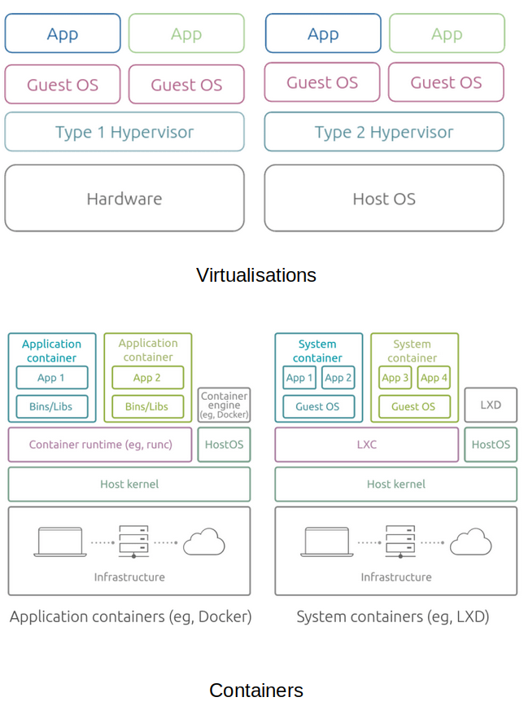

# Container Technologies

A container is a lightweight runtime packaging technology.

## Change Root `chroot`

`chroot` (Change root) is a Unix system utility used to change the apparent root directory to create a new environment logically separate (i.e. container) from the main system's root directory.  

* [How to Use the chroot Command on Linux](https://www.howtogeek.com/441534/how-to-use-the-chroot-command-on-linux/)
* [Working examples](../examples/chroot/jailer.sh)

## Orchestration Tools

* [Docker](https://github.com/paulwizviz/learn-docker.git)
* [Kubernetes](https://github.com/paulwizviz/learn-k8s.git)

## References

* [What Is Container Technology?](https://www.solarwinds.com/resources/it-glossary/container)
* [Containers vs Virtualization by Miona Aleksic](https://ubuntu.com/blog/containerization-vs-virtualization)
