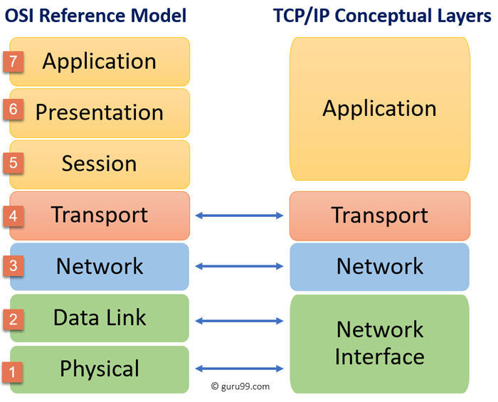

# Networking

* [Practical Networking](https://www.youtube.com/watch?v=bj-Yfakjllc&list=PLIFyRwBY_4bRLmKfP1KnZA6rZbRHtxmXi)

## Software Networking and Interfaces on Linux

* [Part 1](https://www.youtube.com/watch?v=EnAZB8GI97c)
* [Part 2](https://www.youtube.com/watch?v=5WNEpE1vLvc)

## OSI Model

The OSI model is a theoretical stack describing how applications and devices communicate over a network.

### Level 3 - Network Layer

The protocols in this layer are:

* [Internet Protocol (IP)](./ip.md)
* [Internet Control Message Protocol](https://www.ietf.org/rfc/rfc792.txt)
  * [What is the Internet Control Message Protocol (ICMP)?](https://www.cloudflare.com/en-gb/learning/ddos/glossary/internet-control-message-protocol-icmp/)

### Level 4 - Transport Layer

The protocols in this layer are:

* [Transmission Control Protocol](https://www.ietf.org/rfc/rfc793.txt)
* [User Datagram Protocol](https://www.ietf.org/rfc/rfc768.txt)

### Level 7 - Application Layer

The protocols in this layer are:

* [HTTP](https://en.wikipedia.org/wiki/HTTP)
  * [What is HTTP](https://www.cloudflare.com/en-gb/learning/ddos/glossary/hypertext-transfer-protocol-http/)
* [FTP](https://en.wikipedia.org/wiki/File_Transfer_Protocol)
* [SMTP](https://en.wikipedia.org/wiki/Simple_Mail_Transfer_Protocol)

## TCP/IP Model

* [A TCP/IP Tutorial](https://www.ietf.org/rfc/rfc1180.txt)

## Internet of Things

The key components are:

### Hardware

* **Sensors:** These devices collect data from the environment, such as temperature, pressure, light, and motion.
* **Actuators:** These devices can control physical systems, such as turning on and off lights, opening and closing valves, and moving motors.
* **Microcontrollers:** These small computers are used to process data from sensors and control actuators.
* **Connectivity hardware:** This includes devices such as Wi-Fi routers, Bluetooth chips, and cellular modems, which allow IoT devices to communicate with each other and with the internet.

### Protocols

* Connectivity Protocols (How devices connect to the network):
  * **Wi-Fi**: A widely used wireless technology for connecting devices to a local network and the internet. It's common in homes and offices.
  * **Bluetooth/Bluetooth Low Energy (BLE)**: Short-range wireless technology often used for connecting personal devices like wearables and smartphones to IoT devices. BLE is designed for low power consumption.
  * **Zigbee:** A low-power, low-data rate wireless protocol ideal for mesh networks in home automation and industrial control.
  * **Z-Wave:** Another popular mesh network protocol primarily used for home automation.
  * **Cellular (3G, 4G, 5G, LTE-M, NB-IoT):** These technologies enable IoT devices to connect directly to cellular networks, useful for devices that need wider coverage.
  * **LoRaWAN (Long Range Wide Area Network):** Designed for long-range communication with low power consumption, suitable for applications like smart agriculture and environmental monitoring.
  * **Sigfox:** Another long-range, low-power wide-area network technology.
* Data Protocols (How devices exchange data):
  * **MQTT (Message Queuing Telemetry Transport):** A lightweight messaging protocol ideal for constrained devices and unreliable networks. It's widely used in IoT for its efficiency and publish/subscribe mechanism.
  * **CoAP (Constrained Application Protocol):** A web transfer protocol designed for low-power devices and lossy networks. It's similar to HTTP but optimized for IoT.
  * **AMQP (Advanced Message Queuing Protocol):** A robust messaging protocol that ensures reliable message delivery. It's often used in industrial IoT applications.
  * **HTTP/HTTPS:** The foundation of the web, also used in IoT for devices that need to communicate with web services.
  * **WebSockets:** Enables real-time, bidirectional communication between devices and servers.
  * **JetStream:** A streaming data protocol built into the NATS server, designed for high-throughput, persistent, and reliable delivery of data streams. It features built in flow control, and ordered delivery. Well suited for high volume telemetry data, and use cases that require data durability.
* Data Serialization: Most widely quoted.
  * [JSON](https://www.json.org/json-en.html)
  * [Concise Binary Object Representation (CBOR)](https://cbor.io/)
  * [XML](https://www.w3.org/TR/xml/)
* Other Important Protocols:
  * **Modbus:** An industrial protocol used for communication with programmable logic controllers (PLCs) and other industrial equipment. OPC UA (OLE for Process Control Unified Architecture): Another industrial protocol for data exchange and communication in automation systems.
  * **DDS (Data Distribution Service):** A high-performance protocol for real-time data distribution, often used in applications like autonomous vehicles and robotics.

> NOTE: it is necessary to distinguish data protocols and data serialisation protocols
>
> **Data Protocols:**
>
> **Purpose:** Define the rules and formats for how data is transmitted between devices or applications over a network.
>
> **Focus:** The "how" of data transmission. They specify things like: Addressing (where the data is going), Routing (how the data gets there), Error handling (how to deal with lost or corrupted data), Connection management (how to establish and maintain connections).
>
> **Examples:** MQTT, CoAP, AMQP, HTTP, WebSockets, JetStream.
>
> **Data Serialization:**
>
> **Purpose:** Define the format for how data is structured and encoded into a stream of bytes that can be transmitted over a network or stored.
>
> **Focus:** The "what" of data representation. They specify things like: Data types (integers, strings, objects, etc.), Data structures (arrays, dictionaries, etc.), Encoding (how to convert data into a binary or text format).
>
> **Examples**: JSON, Protocol Buffers, CBOR, XML.

| Feature | MQTT | CoAP | AMQP | HTTP/HTTPS | WebSockets |JetStream |
|---|---|---|---|---|---|---|
| **Focus** | Constrained devices | Constrained devices | Reliable messaging | Web interaction | Real-time comms | Streaming data |
| **Model** | Publish/Subscribe | Request/Response | Message Queuing | Request/Response | Bidirectional | Publish/Subscribe |
| **Overhead** | Low | Low | High | High | Moderate | Moderate |
| **Reliability** | Variable (QoS) | Lower (UDP) | High | Variable (TCP) | Reliable (TCP) | High (Persistence) |
| **Complexity** | Low | Low | High | Moderate | Moderate | Moderate |
| **Use Cases** | Sensors, M2M | Smart devices | Industrial, finance | Web-connected devices | Real-time apps | High-volume IoT, telemetry, analytics |
| **Key Strengths** | Lightweight, efficient | Lightweight, UDP-based | Guaranteed delivery | Widely understood, tools | Real-time, bi-directional | High throughput, persistence, flow control |
| **Key Weaknesses** | Not always guaranteed delivery | UDP, less reliable than TCP | Complex, resource intensive | Resource-intensive | More complex than HTTP for simple data | Requires NATS server |

Choosing the right protocol depends on several factors:

* **Range:** How far apart are the devices?
* **Bandwidth:** How much data needs to be transmitted?
* **Power consumption:** How much power do the devices use?
* **Security:** How important is data security?
* **Cost:** How much does it cost to implement the protocol?

Useful references:

* [Unified Data Standards in IoT: Common Protocols, Challenges, and the Path to Interoperability - By Linh Chu Dieu, 21 November 2024](https://smartdev.com/unified-data-standards-in-iot-enabling-interoperability-and-seamless-communication/)

## Tools

* [Deep Dive: The ip Command in Linux](https://www.youtube.com/watch?v=30mQ4fD5kMI)
* [ifconfig mac](https://www.youtube.com/watch?v=4-5x7iLiVSg)

## Programming

* [libp2p-pubsub Peer Discovery with Kademlia DHT](https://medium.com/rahasak/libp2p-pubsub-peer-discovery-with-kademlia-dht-c8b131550ac7)
