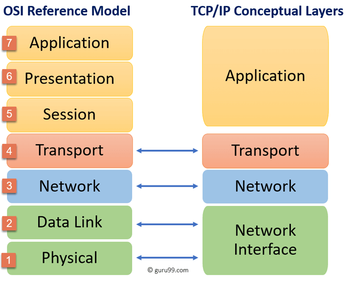

# Computer Networking

Computer networking is the practice of interconnecting two or more computing devices—such as servers, workstations, and mobile devices—to facilitate the exchange of data and the sharing of resources. It serves as the backbone of modern IT infrastructure, primarily utilising the TCP/IP protocol suite to enable communication across local and wide-area networks.

While the fundamental principles of data transmission are shared across all networking domains, computer networking is distinct in its focus and requirements:

* **Device Capability:** Unlike the Internet of Things (IoT), which often involves resource-constrained sensors and actuators, computer networking typically connects more powerful devices capable of handling complex protocol stacks and high-bandwidth applications.
* **Performance Priorities:** General-purpose computer networking prioritises throughput, scalability, and flexibility. In contrast, industrial networking (Operational Technology) often prioritises deterministic, real-time performance and extreme environmental robustness to ensure safety and reliability in manufacturing or utility environments.
* **User Interaction:** It is frequently designed to support user-facing services such as web browsing, file sharing, and remote access, whereas other domains may focus purely on machine-to-machine (M2M) telemetry.

## OSI Model

The OSI model is a theoretical stack describing how applications and devices communicate over a network.

### Level 3 - Network Layer

The protocols in this layer are:

* [Internet Protocol (IP)](./ip.md)
* [Internet Control Message Protocol](https://www.ietf.org/rfc/rfc792.txt)
  * [What is the Internet Control Message Protocol (ICMP)?](https://www.cloudflare.com/en-gb/learning/ddos/glossary/internet-control-message-protocol-icmp/)

### Level 4 - Transport Layer

The protocols in this layer are:

* [Transmission Control Protocol](https://www.ietf.org/rfc/rfc793.txt)
* [User Datagram Protocol](https://www.ietf.org/rfc/rfc768.txt)

### Level 7 - Application Layer

The protocols in this layer are:

* [HTTP](https://en.wikipedia.org/wiki/HTTP)
  * [What is HTTP](https://www.cloudflare.com/en-gb/learning/ddos/glossary/hypertext-transfer-protocol-http/)
* [FTP](https://en.wikipedia.org/wiki/File_Transfer_Protocol)
* [SMTP](https://en.wikipedia.org/wiki/Simple_Mail_Transfer_Protocol)

## TCP/IP Model

While the OSI and TCP/IP models share a similar hierarchical approach, the TCP/IP model is considered more practical and has "flattened" the seven OSI layers into a more streamlined four-layer architecture. For example, the OSI Application, Presentation, and Session layers are consolidated into a single Application layer in the TCP/IP model, while the Data Link and Physical layers are often grouped into a single Network Access (or Link) layer.

* [A TCP/IP RFC1180](https://www.ietf.org/rfc/rfc1180.txt)

## Tools

The following tools are commonly used to inspect, configure, and manage network interfaces and connectivity:

* [Deep Dive: The ip Command in Linux](https://www.youtube.com/watch?v=30mQ4fD5kMI)
* [ifconfig mac](https://www.youtube.com/watch?v=4-5x7iLiVSg)

## Software Networking and Interfaces on Linux

This section covers the practical implementation of networking within the Linux kernel and its user-space interfaces.

* [Part 1](https://www.youtube.com/watch?v=EnAZB8GI97c)
* [Part 2](https://www.youtube.com/watch?v=5WNEpE1vLvc)

## Programming Examples

Practical implementations and code templates for network-based applications:

* [Go Network programming](https://github.com/paulwizviz/go-networking.git)
* [libp2p-pubsub Peer Discovery with Kademlia DHT](https://medium.com/rahasak/libp2p-pubsub-peer-discovery-with-kademlia-dht-c8b131550ac7)

## References

Additional resources and tutorials for further study:

* [Practical Networking](https://www.youtube.com/watch?v=bj-Yfakjllc&list=PLIFyRwBY_4bRLmKfP1KnZA6rZbRHtxmXi)
