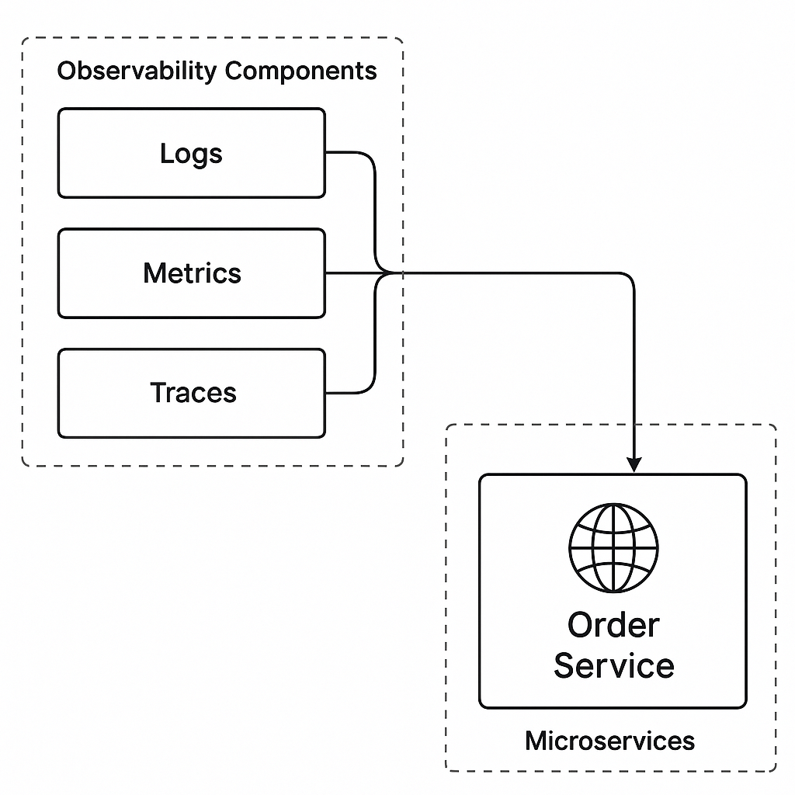

# Observability

Observability is the ability to understand the internal state of a system based on the data it produces — particularly logs, metrics, and traces. It is a key concept for distributed systems where simply monitoring is not enough.

## Key Features

* Logs
  * Human-readable, timestamped records of events.
  * Great for debugging and forensics.
  * Example: “User ID 123 failed login due to invalid token”.
* Metrics
  * Numeric representations of system health (counters, gauges, histograms).
  * Ideal for monitoring and alerting.
  * Example: CPU usage, requests per second, error rate.
* Traces
  * Records of requests as they travel through different services.
  * Useful for understanding latency and bottlenecks.
  * Example: A trace showing how a request to /checkout hit service A → B → C.

## Tools

* **Logging:** ELK Stack (Elasticsearch, Logstash, Kibana), Fluentd, Loki
* **Metrics:** Prometheus, Grafana, Datadog, CloudWatch
* **Tracing:** OpenTelemetry, Jaeger, Zipkin

## Observability Relationship with Services

## Observability vs Monitoring

| Monitoring | Observability |
| --- | --- |
| Predefined alerts | Open-ended questions |
| Focus on known issues | Explore unknowns |
| Tells you something is wrong | Helps you understand why |
