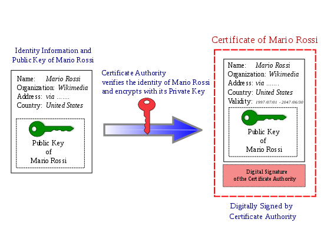

# Security

This section discuss topics related to digital security.

## Public Key Infrastructure

* [PKI Components - CompTIA Security+ SY0-501 - 6.4](https://www.youtube.com/watch?v=3yuad7_bszE)
* [5280 - Internet X.509 Public Key Infrastructure Certificate and Certificate Revocation List (CRL) Profile](https://datatracker.ietf.org/doc/html/rfc5280)
* [1422 - Privacy Enhancement for Internet Electronic Mail: Part II: Certificate-Based Key Management](https://datatracker.ietf.org/doc/html/rfc1422)

## Public Key Certificates

In cryptography, a public key certificate, also known as a digital certificate or identity certificate, is an electronic document used to prove the validity of a public key (Source: [wiki](https://en.wikipedia.org/wiki/Public_key_certificate)).

[Certificate Concepts - SY0-601 CompTIA Security+ : 3.9](https://www.youtube.com/watch?v=nUuFwkyw0xs)

### Procedure of obtaining Public Key certificate

 
[Copyright Wikipedia](https://en.wikipedia.org/wiki/Public_key_certificate)

### X.509 certificate

An X.509 certificate is a digital certificate that uses the widely accepted international X.509 public key infrastructure (PKI) standard to verify that a public key belongs to the user, computer or service identity contained within the certificate (see [Defintion from the TechTarget July 2020](https://www.techtarget.com/searchsecurity/definition/X509-certificate))

X.509 common fields are: 

* Version – which X.509 version applies to the certificate (which indicates what data the certificate must include)
* Serial number – the identity creating the certificate must assign it a serial number that distinguishes it from other certificates
* Issuer name – the name of the entity issuing the certificate (usually a certificate authority)
* Validity period of the certificate – start/end date and time
* Subject distinguished name – the name of the identity the certificate is issued to
* Subject public key information – the public key associated with the identity
* Algorithm information – the algorithm used by the issuer to sign the certificate
* Extensions (optional)

Certificate syntax ASN.1:

```
    Certificate ::= SIGNED SEQUENCE{
           version [0]     Version DEFAULT v1988,
           serialNumber    CertificateSerialNumber,
           signature       AlgorithmIdentifier,
           issuer          Name,
           validity        Validity,
           subject         Name,
           subjectPublicKeyInfo    SubjectPublicKeyInfo}

   Version ::=     INTEGER {v1988(0)}

   CertificateSerialNumber ::=     INTEGER

   Validity ::=    SEQUENCE{
           notBefore       UTCTime,
           notAfter        UTCTime}

   SubjectPublicKeyInfo ::=        SEQUENCE{
           algorithm               AlgorithmIdentifier,
           subjectPublicKey        BIT STRING}


   AlgorithmIdentifier ::= SEQUENCE{
           algorithm       OBJECT IDENTIFIER,
           parameters      ANY DEFINED BY algorithm OPTIONAL}
```

Certificate Revocation List syntax:

```
    CertificateRevocationList ::= SIGNED SEQUENCE{
           signature       AlgorithmIdentifier,
           issuer          Name,
           lastUpdate      UTCTime,
           nextUpdate      UTCTime,
           revokedCertificates
                           SEQUENCE OF CRLEntry OPTIONAL}

   CRLEntry ::= SEQUENCE{
           userCertificate SerialNumber,
           revocationDate UTCTime}
```

Source: [wiki](https://en.wikipedia.org/wiki/X.509)

### Types of certificate

* Root certificate - A public key certificate that identifies the root CA. It is used to issue other certificates.
* Domain validation certificate - Owner of this certificate has control over a domain
* Extended validation certificate - Contains additional information to verify the owner's identity
* Subject Alternative Name (SAN) - This is an extension to X.509 certification which is used to support many different domains
* Wildcard domain - Certificate based the name of the server
* Internal certificate - Based on own CA

Source: [Professor Messer](https://www.youtube.com/watch?v=o5gAgmRjo6A)

* TLS/SSL server certificate - use by server to present a digital certificate proving that it is the intended destination. The Subject field of the certificate must identify the primary host name of the server as the Common Name.
* TLS/SSL client certificate - use by a TLS service to authenticate a client.
* Email certificate - to ensure the integrity and encryption of email message.
* Self-signed and root certificates.
* EMV certificate - use to validate the authenticity of a payment card.
* Code-signing certificate - to validate binaries.
* Qualified certificate - use to identify an individual via electronic signature.
* Role-base certificate - identify the role of a subscriber.
* Group certificate.

Source: [wiki](https://en.wikipedia.org/wiki/X.509)

### Certificate filename extensions

* .pem – ([Privacy-enhanced Electronic Mail](./pem.md)) Base64 encoded DER certificate, enclosed between "-----BEGIN CERTIFICATE-----" and "-----END CERTIFICATE-----"
* .cer, .crt, .der – usually in binary DER form, but Base64-encoded certificates are common too (see .pem above)
* .p7b, .p7c – PKCS#7 SignedData structure without data, just certificate(s) or CRL(s)
* .p12 – PKCS#12, may contain certificate(s) (public) and private keys (password protected)
* .pfx – PFX, predecessor of PKCS#12 (usually contains data in PKCS#12 format, e.g., with PFX files generated in IIS)

Source: [wiki](https://en.wikipedia.org/wiki/X.509#Certificate_filename_extensions) & [Professor Messer](https://www.youtube.com/watch?v=5T6MjlFsRWI)


## Data verification

* [Checksum](https://www.techtarget.com/searchsecurity/definition/checksum)      
